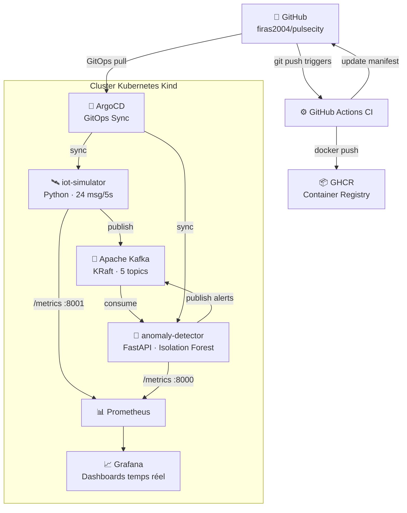

# 🏙️ PulseCity — Plateforme Cloud Native de Surveillance Urbaine Intelligente


> Plateforme IoT en temps réel pour la surveillance intelligente de 6 villes tunisiennes : Tunis, Ariana, Ben-Arous, La-Marsa, Sfax et Sousse.

---

## 📑 Table des matières

1. [Vue d'ensemble](#vue-densemble)
2. [Architecture](#architecture)
3. [Stack technique](#stack-technique)
4. [Prérequis](#prérequis)
5. [Déploiement complet depuis zéro](#déploiement-complet-depuis-zéro)
6. [Pipeline CI/CD](#pipeline-cicd)
7. [API Reference](#api-reference)
8. [Monitoring](#monitoring)
9. [Sécurité](#sécurité)
10. [Tests de charge](#tests-de-charge)
11. [Structure du dépôt](#structure-du-dépôt)

---

## Vue d'ensemble

PulseCity est une architecture **Cloud Native** complète simulant un système IoT de surveillance urbaine :

- 🛰 **6 zones** géographiques tunisiennes instrumentées
- 📡 **4 types de capteurs** : trafic, qualité de l'air (CO₂), bruit, énergie
- 🤖 **IA en temps réel** : algorithme Isolation Forest (scikit-learn) pour la détection d'anomalies
- 📊 **Observabilité** : Prometheus + Grafana avec dashboards et alertes
- 🔄 **GitOps** : ArgoCD synchronise automatiquement le cluster depuis GitHub
- 🔒 **Sécurité** : Network Policies, securityContext, scan Trivy, secrets K8s

---

## Architecture

```
┌─────────────────────────────────────────────────────────────────────────────┐
│                     Cluster Kind "pulsecity" (Kubernetes local)             │
│                                                                             │
│  ┌──────────────┐   Kafka topics    ┌──────────────────────┐               │
│  │ iot-simulator│  ──────────────►  │  anomaly-detector    │               │
│  │  (Python)    │  traffic-data     │  (FastAPI + IsolFrst)│               │
│  │  6 zones     │  air-quality      │  /health             │               │
│  │  4 capteurs  │  noise-level      │  /anomalies          │               │
│  │  24 msg/5s   │  energy-data      │  /metrics            │               │
│  └──────┬───────┘  alerts     ◄─── └─────────┬────────────┘               │
│         │ :8001/metrics                       │ :8000/metrics              │
│         │                                     │                            │
│  ┌──────▼─────────────────────────────────────▼────────────┐               │
│  │              Prometheus (kube-prometheus-stack)          │               │
│  │  ServiceMonitor iot  │  ServiceMonitor anomaly           │               │
│  │  Alertmanager        │  PrometheusRule                   │               │
│  └──────────────────────────┬───────────────────────────────┘               │
│                             │                                               │
│                    ┌────────▼───────┐       ┌─────────────────────┐        │
│                    │    Grafana     │       │       ArgoCD         │        │
│                    │  :3000         │       │  :8080               │        │
│                    │  Dashboards    │       │  GitOps sync         │        │
│                    └────────────────┘       │  k8s/ ←── GitHub    │        │
│                                             └─────────────────────┘        │
│                                                                             │
│  namespace: kafka   ┌───────────┐                                          │
│                     │  Kafka    │  (cp-kafka:7.7.0, KRaft, 5 topics)       │
│                     └───────────┘                                          │
└─────────────────────────────────────────────────────────────────────────────┘
```



---

## Stack technique

| Couche | Technologie | Version |
|--------|-------------|---------|
| Orchestration | Kubernetes (Kind) | v1.29 |
| Conteneurs | Docker Desktop | Latest |
| Messagerie | Apache Kafka (KRaft) | cp-kafka 7.7.0 |
| IA / ML | scikit-learn (Isolation Forest) | 1.4.2 |
| API REST | FastAPI + Uvicorn | 0.111.0 |
| Monitoring | Prometheus + Grafana | Stack 87.6.0 |
| CI | GitHub Actions | — |
| CD / GitOps | ArgoCD | v7.8.2 (Helm) |
| Registry | GHCR (GitHub Container Registry) | — |
| OS de dev | Windows 11 + PowerShell | — |

---

## Prérequis

| Outil | Version minimale | Installation |
|-------|-----------------|--------------|
| Docker Desktop | 4.x | [docker.com](https://www.docker.com/products/docker-desktop/) |
| Kind | 0.20+ | `winget install Kubernetes.kind` |
| kubectl | 1.29+ | Inclus avec Docker Desktop |
| Helm | 3.14+ | `winget install Helm.Helm` |
| git | 2.x | `winget install Git.Git` |
| Python | 3.11+ | [python.org](https://www.python.org/) |

---

## Déploiement complet depuis zéro

### 1. Cloner le dépôt

```powershell
git clone https://github.com/firas2004/pulsecity.git
cd pulsecity
```

### 2. Créer le cluster Kind

```powershell
# Créer le cluster
kind create cluster --name pulsecity

# Vérifier le cluster
kubectl cluster-info --context kind-pulsecity
kubectl get nodes
```

### 3. Déployer Apache Kafka

```powershell
# Créer le namespace
kubectl create namespace kafka

# Déployer Kafka (KRaft, sans ZooKeeper)
kubectl apply -f iot-simulator/kafka-k8s.yaml

# Attendre que Kafka soit prêt (2-3 minutes)
kubectl wait --for=condition=ready pod/kafka-0 -n kafka --timeout=300s

# Créer les 5 topics
$topics = @("traffic-data", "air-quality", "noise-level", "energy-data", "alerts")
foreach ($topic in $topics) {
    kubectl exec -n kafka kafka-0 -- kafka-topics `
        --bootstrap-server localhost:9092 `
        --create --topic $topic `
        --partitions 1 --replication-factor 1
    Write-Host "✅ Topic créé : $topic"
}

# Vérifier les topics
kubectl exec -n kafka kafka-0 -- kafka-topics `
    --bootstrap-server localhost:9092 --list
```

### 4. Construire et charger les images Docker

```powershell
# IoT Simulator
docker build -t pulsecity-sensor:v3 iot-simulator/
kind load docker-image pulsecity-sensor:v3 --name pulsecity

# Anomaly Detector
docker build -t pulsecity-anomaly-detector:v1 anomaly-detector/
kind load docker-image pulsecity-anomaly-detector:v1 --name pulsecity
```

### 5. Déployer les microservices

```powershell
# IoT Simulator
kubectl apply -f iot-simulator/deployment.yaml
kubectl apply -f k8s/iot-simulator/service-metrics.yaml

# Anomaly Detector
kubectl apply -f anomaly-detector/deployment.yaml
kubectl apply -f k8s/anomaly-detector/service.yaml

# Vérifier
kubectl get pods -l project=pulsecity
```

### 6. Déployer Prometheus + Grafana

```powershell
# Ajouter le repo Helm Prometheus Community
helm repo add prometheus-community https://prometheus-community.github.io/helm-charts
helm repo update prometheus-community

# Installer la stack de monitoring
kubectl create namespace monitoring
helm install monitoring prometheus-community/kube-prometheus-stack `
    --namespace monitoring `
    --values monitoring/prometheus-values.yaml `
    --version 87.6.0

# Appliquer les ServiceMonitors et règles d'alertes
kubectl apply -f monitoring/servicemonitor-iot.yaml
kubectl apply -f monitoring/servicemonitor-anomaly.yaml
kubectl apply -f monitoring/pulsecity-rules.yaml

# Accéder à Grafana (admin/prom-operator)
kubectl port-forward svc/monitoring-grafana -n monitoring 3000:80
# → http://localhost:3000
```

### 7. Déployer ArgoCD

```powershell
# Installer ArgoCD via Helm
kubectl create namespace argocd
helm install argocd `
    https://github.com/argoproj/argo-helm/releases/download/argo-cd-7.8.2/argo-cd-7.8.2.tgz `
    --namespace argocd --create-namespace

# Attendre qu'ArgoCD soit prêt
kubectl wait --for=condition=ready pod -l app.kubernetes.io/name=argocd-server `
    -n argocd --timeout=300s

# Récupérer le mot de passe admin
$password = [System.Text.Encoding]::UTF8.GetString(
    [System.Convert]::FromBase64String(
        (kubectl -n argocd get secret argocd-initial-admin-secret `
            -o jsonpath="{.data.password}")
    )
)
Write-Host "🔑 Mot de passe ArgoCD : $password"

# Configurer les applications ArgoCD
kubectl apply -f argocd/applications.yaml

# Accéder à l'interface ArgoCD
kubectl port-forward svc/argocd-server -n argocd 8080:443
# → https://localhost:8080  (admin / <password affiché>)
```

### 8. Appliquer les Network Policies

```powershell
kubectl apply -f k8s/network-policies/
```

### 9. Vérification finale

```powershell
# Tous les pods en Running
kubectl get pods -A

# Vérifier que l'anomaly-detector fonctionne
kubectl port-forward svc/anomaly-detector 8000:8000
# Dans un autre terminal :
Invoke-RestMethod http://localhost:8000/health
Invoke-RestMethod http://localhost:8000/anomalies
```

---

## Pipeline CI/CD

À chaque `git push` sur la branche `main` :

```
git push origin main
       │
       ▼
GitHub Actions (ci-iot-simulator.yml / ci-anomaly-detector.yml)
       │
       ├── pytest tests/ --cov               ← Tests unitaires
       ├── docker buildx build               ← Build de l'image
       ├── trivy image (scan sécurité)       ← Scan CVE
       ├── docker push ghcr.io/firas2004/…   ← Push sur GHCR
       └── sed -i "image: sha-<SHA>"         ← Mise à jour du manifest
              └── git commit & push
                     │
                     ▼
              ArgoCD détecte le changement de manifest
                     │
                     ▼
              kubectl apply automatique sur le cluster
```

### Configurer les secrets GitHub Actions

Dans `Settings → Secrets → Actions` de votre repository, créez :

| Secret | Description |
|--------|-------------|
| `GHCR_TOKEN` | Personal Access Token GitHub avec scope `write:packages` |
| `GIT_USER_NAME` | Votre nom d'utilisateur GitHub (ex: `firas2004`) |
| `GIT_USER_EMAIL` | Votre email GitHub |

---

## API Reference

### Anomaly Detector (port 8000)

| Méthode | Endpoint | Description |
|---------|----------|-------------|
| `GET` | `/health` | État de santé du service et statistiques |
| `GET` | `/anomalies?limit=20` | Liste des dernières anomalies détectées |
| `GET` | `/metrics` | Métriques Prometheus (scraping) |

### Exemple de réponse `/health`

```json
{
  "status": "ok",
  "service": "pulsecity-anomaly-detector",
  "version": "2.0.0",
  "kafka_bootstrap": "kafka.kafka.svc.cluster.local:9092",
  "window_size": 50,
  "min_samples": 15,
  "anomaly_threshold": -0.05,
  "total_messages_consumed": 1247,
  "total_anomalies_detected": 89,
  "active_sensors": 24,
  "started_at": "2026-07-04T08:00:00Z"
}
```

### Exemple de réponse `/anomalies`

```json
{
  "count": 3,
  "anomalies": [
    {
      "timestamp": "2026-07-04T09:00:00Z",
      "detected_at": "2026-07-04T09:00:00Z",
      "sensor_id": "tunis-centre-air_co2-001",
      "sensor_type": "air_co2",
      "zone": "Tunis-Centre",
      "value": 1487.14,
      "unit": "ppm",
      "isolation_score": -0.2341,
      "confidence": 0.468,
      "anomaly": true,
      "alert_level": "MEDIUM",
      "source": "isolation-forest-v2",
      "message": "[IA] Anomalie sur air_co2 à Tunis-Centre : 1487.14 ppm (score=-0.2341, conf=47%)"
    }
  ]
}
```

---

## Monitoring

| Service | URL locale | Identifiants |
|---------|------------|--------------|
| Grafana | http://localhost:3000 | admin / prom-operator |
| Prometheus | http://localhost:9090 | — |
| ArgoCD | https://localhost:8080 | admin / `<secret K8s>` |
| Anomaly Detector API | http://localhost:8000 | — |

### Métriques clés

| Métrique | Type | Description |
|----------|------|-------------|
| `pulsecity_anomalies_total` | Counter | Anomalies détectées par zone et type |
| `pulsecity_messages_consumed_total` | Counter | Messages Kafka traités |
| `pulsecity_processing_latency_seconds` | Histogram | Latence de l'inférence Isolation Forest |
| `pulsecity_active_sensors` | Gauge | Nombre de capteurs actifs |
| `pulsecity_messages_sent_total` | Counter | Messages envoyés par le simulateur |

---

## Sécurité

### Scan des images Docker

```powershell
# Installer Trivy sur Windows
winget install AquaSecurity.Trivy

# Scanner les images
trivy image pulsecity-sensor:v3
trivy image pulsecity-anomaly-detector:v1

# Scanner avec rapport JSON
trivy image --format json --output trivy-report.json pulsecity-sensor:v3
```

### Network Policies appliquées

```powershell
kubectl apply -f k8s/network-policies/
kubectl get networkpolicies -n default
```

### Vérifier les secrets Kubernetes

```powershell
# Aucun mot de passe en dur — tout est dans les variables d'environnement
kubectl get secrets -n default
kubectl get secrets -n argocd
```

---

## Tests de charge

```powershell
# Installer k6 sur Windows
winget install k6

# Exposer l'API localement
kubectl port-forward svc/anomaly-detector 8000:8000

# Dans un autre terminal, lancer le test
cd load-testing
k6 run load-test.js

# Avec rapport JSON
k6 run --out json=results/report.json load-test.js

# Test de débit Kafka (depuis un pod dans le cluster)
kubectl run stress --image=python:3.11-slim --restart=Never -- sleep 3600
kubectl exec -it stress -- pip install kafka-python
kubectl cp load-testing/kafka-stress.py stress:/kafka-stress.py
kubectl exec -it stress -- python /kafka-stress.py `
    --broker kafka.kafka.svc.cluster.local:9092 `
    --rate 1000 --duration 60
kubectl delete pod stress
```

---

## Structure du dépôt

```
pulsecity/
├── .github/
│   └── workflows/
│       ├── ci-iot-simulator.yml      # Pipeline CI simulateur
│       └── ci-anomaly-detector.yml   # Pipeline CI détecteur
│
├── iot-simulator/                    # Microservice 1 : Simulateur IoT
│   ├── sensor.py                     # Générateur de données (Kafka + Prometheus)
│   ├── Dockerfile                    # Image Python 3.11-slim
│   ├── requirements.txt
│   ├── deployment.yaml               # Déploiement K8s local
│   ├── kafka-k8s.yaml                # StatefulSet Kafka (KRaft)
│   ├── kafka-values.yaml
│   ├── tests/
│   │   └── test_sensor.py
│   └── README.md
│
├── anomaly-detector/                 # Microservice 2 : Détecteur d'anomalies IA
│   ├── detector.py                   # FastAPI + Isolation Forest + Kafka
│   ├── Dockerfile
│   ├── requirements.txt
│   ├── deployment.yaml
│   ├── service.yaml
│   ├── tests/
│   │   └── test_detector.py
│   └── README.md
│
├── k8s/                              # Manifests de production pour ArgoCD
│   ├── iot-simulator/
│   │   ├── deployment.yaml           # Deployment durci (securityContext)
│   │   └── service-metrics.yaml
│   ├── anomaly-detector/
│   │   ├── deployment.yaml           # Deployment durci (securityContext)
│   │   └── service.yaml
│   └── network-policies/
│       ├── deny-all.yaml             # Politique Zero Trust
│       ├── allow-iot-simulator.yaml
│       ├── allow-anomaly-detector.yaml
│       └── allow-monitoring.yaml
│
├── monitoring/                       # Stack Prometheus + Grafana
│   ├── prometheus-values.yaml
│   ├── servicemonitor-iot.yaml
│   ├── servicemonitor-anomaly.yaml
│   ├── pulsecity-rules.yaml
│   └── grafana-dashboard.yaml
│
├── argocd/
│   └── applications.yaml            # Applications ArgoCD (GitOps)
│
├── load-testing/
│   ├── load-test.js                  # Script k6 (50 VU, 2 min)
│   ├── kafka-stress.py               # Stress test Kafka (1000 msg/s)
│   └── results/                      # Rapports générés
│
├── demo.ps1                          # Script de démonstration soutenance
├── JOURNAL_DE_BORD.md               # Journal de bord de stage
├── .gitignore
└── README.md                         ← Ce fichier
```

---

## Auteur

**Firas** — Stagiaire Cloud Native / DevOps  
Projet de stage : Plateforme de surveillance urbaine intelligente IoT  
Juillet 2026

---

*PulseCity — Tous droits réservés — Projet éducatif*
